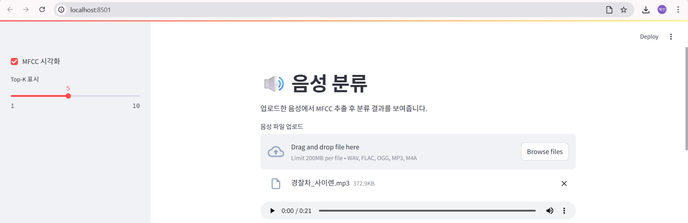
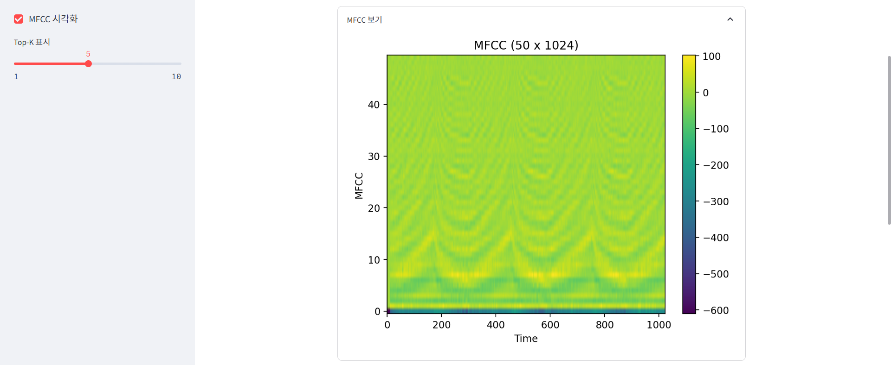
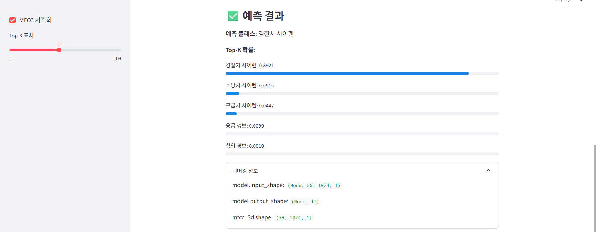

# 🎧 Audio Classification with MFCC & SE-ResNet

> 데이터 불균형 문제를 해결하고, **MFCC + SE-ResNet** 구조를 통해  
> **Macro F1 / Recall 중심의 실질적인 성능 개선**을 달성한 음성 이벤트 분류 모델 및 Streamlit 데모입니다.

---

## 📌 프로젝트 개요

본 프로젝트는 다양한 **경보·사이렌·환경 소리**를 분류하는 음성 이벤트 분류 시스템입니다.

초기 팀 프로젝트에서는 정확도(Accuracy) 중심의 평가로 인해  
👉 **소수 클래스가 거의 예측되지 않는 문제**가 발생했습니다.

이를 개선하기 위해,

- 데이터 분포 분석
- Stratified Split
- 클래스 불균형을 고려한 데이터 증강
- CNN / ResNet → **SE-ResNet 구조 개선**
- 평가 지표를 **Macro F1 / Recall 중심**으로 재설계

를 통해 **모든 클래스에 대해 균형 잡힌 성능 향상**을 목표로 모델을 고도화했습니다.

---

## 🎯 분류 클래스 및 분포

|  |  | Train | Validation | Test |
| --- | --- | --- | --- | --- |
| 0 | 가스누설 화재 경보 | 4 | 2 | 1 |
| 1 | 개 짖는 소리 | 600 | 200 | 200 |
| 2 | 경찰차 사이렌 | 10 | 4 | 4 |
| 3 | 공습 경보 | 6 | 2 | 2 |
| 4 | 구급차 사이렌 | 7 | 2 | 2 |
| 5 | 도난 경보 | 78 | 26 | 26 |
| 6 | 소방차 사이렌 | 7 | 3 | 3 |
| 7 | 응급 경보 | 40 | 13 | 14 |
| 8 | 자동차 경적 | 335 | 112 | 112 |
| 9 | 침입 경보 | 13 | 4 | 4 |
| 10 | 화재 경보 | 112 | 37 | 37 |

> ⚠️ 클래스 간 데이터 수가 극단적으로 불균형한 문제 존재  

---

## 🧠 특징 추출 (Feature Engineering)

### MFCC (Mel-Frequency Cepstral Coefficients)

- Sampling Rate: **16,000 Hz**
- n_fft: **1024**
- hop_length: **256**
- n_mfcc: **50**
- max_len: **1024 frames**

모델 입력 형태: (50, 1024, 1)

데이터 길이 분포 분석 결과, 전체 데이터의 90% 이상이  
1024 frame 이내에 포함됨을 확인하여 `max_len=1024`로 설정했습니다.

Log-Mel Spectrogram과 비교 실험 후,  
**MFCC가 SE-ResNet 구조에서 더 높은 Accuracy / Macro F1 / Recall을 기록**하여 최종 채택했습니다.

---

## 🧪 학습 전략 & 데이터 증강

### 데이터 분할
- Stratified Train / Test Split
- Stratified K-Fold Cross Validation

### 데이터 증강 (Class-aware Augmentation)
- Background Noise 추가
- Gaussian Noise (SNR 기반)
- Pitch Shift
- Time Stretch
- Time Shift / Gain

👉 **소수 클래스일수록 증강 강도를 높여 학습 안정성 확보**

---

## 🏗 모델 구조 발전 과정

1. CNN Baseline  
2. ResNet  
3. **SE-ResNet (최종 선택)**  
4. CBAM-ResNet (비교 실험)

SE(Squeeze-and-Excitation) Block을 통해  
중요한 음향 특징에 더 집중하도록 유도했습니다.

---

## 🏆 최종 성능 (MFCC + SE-ResNet)

| Metric | Score |
|------|------|
| Accuracy | **0.9457** |
| Macro F1-score | **0.7531** |
| Macro Recall | **0.7581** |

> 🔥 극소수 클래스(가스누설 화재경보 등)에 대해서도  
> 기존 모델 대비 **의미 있는 예측 성능 개선** 달성

---

## 🖥 Streamlit 데모

### 주요 기능
- 음성 파일 업로드
- MFCC 시각화
- 분류 결과 출력
- Top-K 확률 분포 표시

